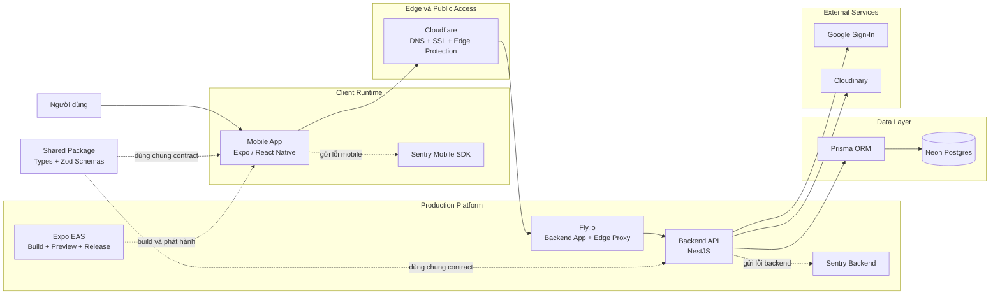

# Kiến trúc hệ thống

## 1. Mục tiêu kiến trúc

Kiến trúc của Meal Planner được thiết kế theo hướng tách biệt rõ các lớp chức năng để hệ thống dễ phát triển, dễ kiểm thử và thuận lợi khi triển khai thực tế. Ba mục tiêu chính là:

- tách riêng mobile app, backend API và database
- dùng chung contract dữ liệu giữa các lớp để giảm sai lệch
- hỗ trợ mở rộng từ môi trường local sang staging và production

## 2. Các khối chính trong hệ thống

### 2.1 Mobile App

- xây dựng bằng Expo và React Native
- là giao diện tương tác chính với người dùng cuối
- đảm nhiệm các luồng đăng nhập, onboarding, profile, meal search, menu và template

### 2.2 Backend API

- xây dựng bằng NestJS theo hướng module hóa
- cung cấp REST API cho mobile app
- xử lý xác thực, logic nghiệp vụ, validation và điều phối dữ liệu

### 2.3 Database và tầng dữ liệu

- sử dụng PostgreSQL làm nơi lưu trữ dữ liệu chính
- Prisma đóng vai trò ORM và quản lý schema/migration
- dữ liệu bao gồm người dùng, hồ sơ cá nhân, món ăn, thực đơn, template và các thực thể liên quan

### 2.4 Shared Package

- chứa kiểu dữ liệu và schema dùng chung giữa mobile app và backend
- giúp đồng bộ request/response contract
- giảm nguy cơ mobile và backend hiểu khác nhau về cùng một dữ liệu

### 2.5 Hạ tầng và dịch vụ production

- Cloudflare đóng vai trò lớp DNS, SSL và điểm vào public cho API
- Fly.io là nơi chạy backend API trong môi trường production
- Neon là dịch vụ PostgreSQL managed cho dữ liệu production
- Expo EAS phục vụ build, preview và phát hành mobile app
- Sentry hỗ trợ monitoring và error tracking cho cả mobile app lẫn backend
- Cloudinary phục vụ quản lý media/ảnh món ăn
- Google Sign-In là dịch vụ xác thực bên ngoài được tích hợp với backend

## 3. Sơ đồ kiến trúc hệ thống tập trung theo hạ tầng

## 4. Luồng hoạt động chính

### 4.1 Luồng sử dụng từ người dùng

1. Người dùng thao tác trên ứng dụng mobile.
2. Ứng dụng mobile được build và phân phối thông qua Expo EAS.
3. Khi mobile app gọi API, request đi qua Cloudflare trước khi vào Fly.io.
4. Fly.io chuyển request tới backend NestJS để xác thực, validate và xử lý nghiệp vụ.
5. Backend truy xuất hoặc cập nhật dữ liệu trong Neon Postgres thông qua Prisma.
6. Khi cần, backend tích hợp với Google Sign-In và Cloudinary.
7. Log lỗi và sự cố từ mobile/backend được gửi về Sentry để theo dõi.
8. Kết quả cuối cùng được trả về mobile app để hiển thị cho người dùng.

### 4.2 Luồng phát triển và triển khai

- Trong môi trường local, nhóm phát triển dùng monorepo cùng Docker Compose để chạy database và các thành phần cần thiết.
- Trong môi trường production mục tiêu, mobile app được build qua Expo EAS, backend được deploy lên Fly.io, dữ liệu được lưu trên Neon Postgres và public API đi qua Cloudflare.
- Sentry được dùng như lớp quan sát hệ thống để theo dõi lỗi ở cả phía client và server.
- Cách tổ chức này cho phép mobile và backend phát hành theo hai nhịp riêng mà không phụ thuộc chặt vào nhau, đồng thời giữ rõ ràng từng lớp hạ tầng.

## 5. Lý do lựa chọn mô hình kiến trúc này

- Phù hợp với ứng dụng mobile có backend riêng và nhiều module nghiệp vụ.
- Dễ mở rộng vì mỗi phần có trách nhiệm rõ ràng.
- Hạn chế lỗi lệch contract nhờ có package shared.
- Thể hiện rõ các lớp hạ tầng runtime gồm edge, compute, database và observability.
- Thuận lợi cho kiểm thử, tài liệu hóa API và bảo trì lâu dài.
- Tạo nền tảng sẵn sàng cho các chức năng nâng cao trong tương lai như gợi ý thực đơn thông minh.

## 6. Tóm tắt

Meal Planner sử dụng kiến trúc client-server hiện đại trong một monorepo thống nhất, nhưng sơ đồ vận hành production được tổ chức theo các lớp hạ tầng rõ ràng: client runtime, edge, compute platform, data layer và observability. Cách nhìn này phản ánh sát hơn cách ứng dụng chạy thực tế, đồng thời cho thấy vai trò của Cloudflare, Fly.io, Neon, Expo EAS, Sentry và các dịch vụ tích hợp ngoài trong toàn bộ hệ thống.