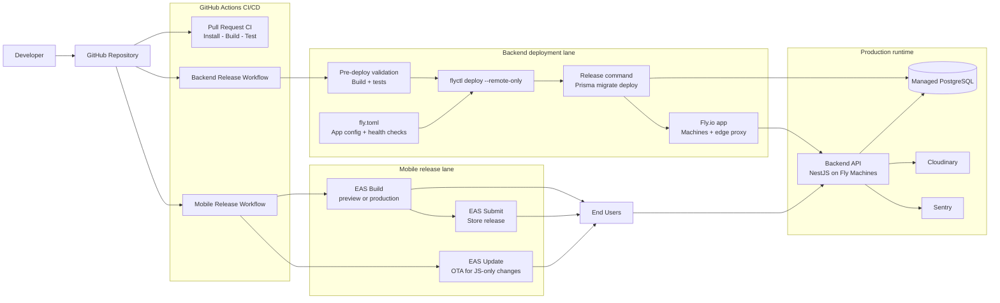
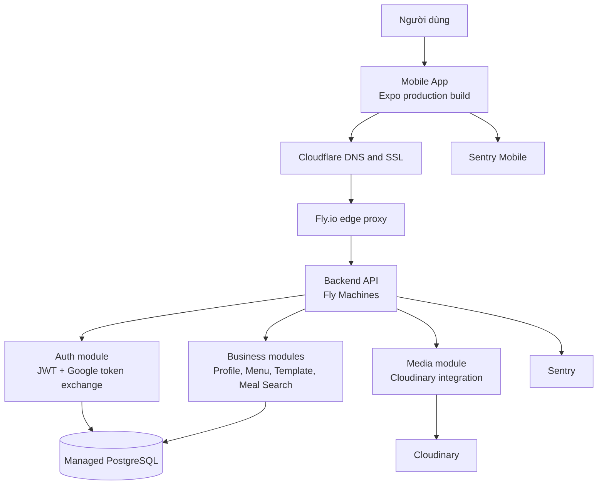
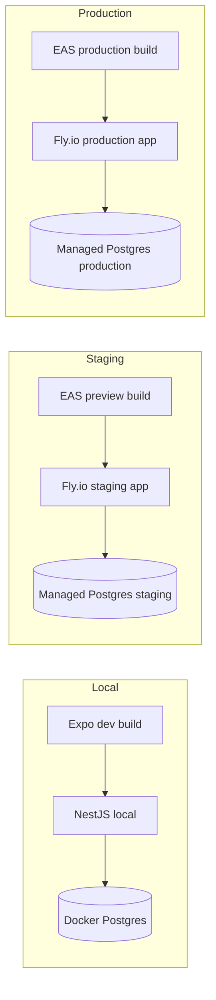

# Production Architecture

## Mục tiêu kiến trúc

Kiến trúc production cho dự án này cần đạt 4 mục tiêu chính:

- tách rõ runtime của mobile app, backend API và database
- không phụ thuộc `docker-compose` local để chạy production
- hỗ trợ `staging` và `production` riêng biệt
- cho phép phát hành backend và mobile app theo hai luồng độc lập

## Các thành phần hiện có trong repo

Theo cấu trúc hiện tại, hệ thống gồm các khối chính sau:

- `apps/mobile-app`: ứng dụng Expo/React Native cho người dùng cuối
- `services/main-backend`: API backend viết bằng NestJS
- `packages/shared`: kiểu dữ liệu và contract dùng chung
- `packages/database`: Prisma schema, migrations và seed
- `infrastructure/docker/main-backend.Dockerfile`: Docker image cho backend
- `infrastructure/docker-compose.yml`: hạ tầng local cho backend, postgres và nginx

## Kiến trúc production được đề xuất

### 1. Mobile app

- Mobile app được build qua `Expo EAS`.
- Mỗi môi trường `staging` và `production` dùng một bộ `EAS environment variables` riêng.
- Mobile app chỉ gọi tới public API domain, ví dụ:
  - `https://api-staging.example.com`
  - `https://api.example.com`

### 2. Backend API

- `services/main-backend` được build từ Dockerfile hiện có và deploy lên `Fly.io`.
- Runtime production chạy trên `Fly.io`, cấu hình bằng `fly.toml` và điều phối qua `flyctl deploy`.
- `Fly.io` sẽ chịu trách nhiệm public ingress, TLS và health checks cho backend app.
- Không dùng `nginx` local trong production trừ khi sau này có nhu cầu reverse proxy tự quản.

### 3. Database

- Database dùng managed PostgreSQL riêng cho `staging` và `production`.
- Prisma migration được chạy trong pipeline deploy, không chạy tay trên máy cá nhân.
- Không dùng chung database giữa các môi trường.

### 4. Media và external services

- Ảnh tiếp tục lưu trên `Cloudinary`.
- Google sign-in dùng bộ client ID đúng theo từng môi trường.
- Monitoring và error tracking dùng `Sentry`.

## Sơ đồ luồng tổng quát

### 1. Luồng build, deploy và release

### 2. Luồng runtime khi người dùng sử dụng ứng dụng

### 3. Luồng tách môi trường

## Diễn giải nhanh cho các sơ đồ

- `Luồng build, deploy và release` mô tả hai lane độc lập: backend lane dùng `flyctl deploy` + `fly.toml`, còn mobile lane dùng EAS cho build, submit và OTA update.
- `Luồng runtime` mô tả đường đi của request thật từ thiết bị người dùng tới DNS/SSL edge, backend API, database, media service và error tracking.
- `Luồng tách môi trường` nhấn mạnh nguyên tắc không dùng chung app runtime và database giữa `local`, `staging` và `production`.

## Branch và environment

Trong tài liệu này, cần tách rõ hai lớp khái niệm:

- `feature/*`, `develop`, `main` là branch source code
- `local`, `staging`, `production` là environment runtime

Hệ quả của việc tách này:

- `staging` là môi trường deploy riêng, không phải branch
- có thể deploy `staging` từ `main` dù không có branch tên `staging`
- `main` chỉ là source branch của release, chưa phải production cho đến khi CI/CD deploy thành công
- `local` là môi trường chạy trên máy dev, không đồng nghĩa với branch `develop`

## Phân tách môi trường

### Local

- là runtime trên máy cá nhân của từng developer
- dùng `.env` ở root repo
- dùng `docker-compose` cho Postgres và Nginx local
- dùng emulator hoặc Expo dev build

### Staging

- là môi trường deploy riêng để QA và smoke test release candidate
- không phải branch code; thường nhận commit từ `main`
- dùng database riêng
- domain riêng, ví dụ `api-staging.example.com`
- build mobile nội bộ hoặc preview build qua EAS
- cho QA và kiểm thử tích hợp trước khi release

### Production

- chỉ nhận bản đã qua kiểm thử ở staging và được approve
- không đồng nghĩa với branch `main`
- domain chính thức, ví dụ `api.example.com`
- secrets riêng hoàn toàn với staging
- chỉ deploy qua pipeline có approval
- chỉ migrate bằng `prisma migrate deploy`

## Vai trò của từng lớp trong kiến trúc

### GitHub Actions

- chạy test, build và deploy
- khóa flow release về một đường chuẩn
- lưu lịch sử build và deploy

### Fly.io

- chạy backend dưới dạng Fly app và Fly Machines mà không cần tự quản VM
- dùng `fly.toml` để khai báo app config, health checks, scaling và non-sensitive env
- dùng `flyctl deploy` để build và deploy từ Dockerfile hiện có
- phù hợp khi đội dự án muốn linh hoạt hơn mô hình PaaS dashboard-first nhưng vẫn chưa cần lên hạ tầng kiểu AWS

### Managed PostgreSQL

- giảm gánh nặng backup, failover và patching
- dễ tách môi trường và kiểm soát connection string
- phù hợp với Prisma schema hiện tại

### Cloudflare

- quản lý DNS và SSL
- có thể thêm caching, WAF và rate limiting cơ bản
- giảm bề mặt tấn công cho public API

### Expo EAS

- tách lane phát hành mobile khỏi backend
- hỗ trợ preview build, production build, store submit và OTA update
- khớp với `apps/mobile-app/eas.json` hiện có

## Quyết định kiến trúc cho giai đoạn đầu

- Không dùng Kubernetes.
- Không tự host PostgreSQL trên VM.
- Không tự duy trì Nginx production nếu host đã có ingress/SSL tốt.
- Tách release backend và release mobile thành hai pipeline riêng.
- Dùng `Fly.io` làm backend runtime mặc định cho `staging` và `production`.
- Dùng `fly.toml` để quản lý app config và health checks cho backend.
- Ưu tiên `staging` trước, chỉ lên `production` sau khi smoke test pass ở staging.

## Các việc kỹ thuật nên làm trước khi deploy thật

- thêm health endpoint riêng cho backend
- đưa CORS về allowlist theo domain thật thay vì wildcard
- đưa cấu hình Swagger server sang biến môi trường thay vì `localhost`
- dùng `prisma migrate deploy` cho production thay vì `prisma migrate dev`
- chuẩn hóa secrets cho Google sign-in giữa backend và mobile
- chuẩn bị `fly.toml` hoặc biến thể cấu hình riêng cho `staging` và `production`